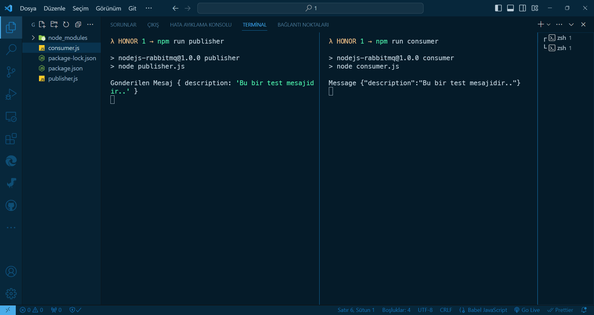
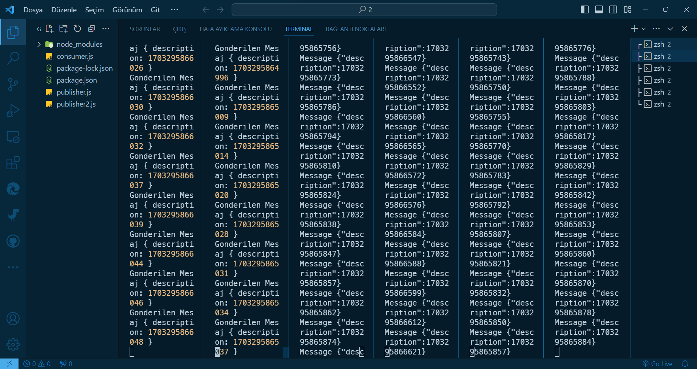

# `NodeJs & RabbitMQ`

### 1️⃣ Project-1 Output

<div align="center">
    
</div>

### 2️⃣ Project-2 Output

<div align="center">
    
</div>

<br>

- A simple RabbitMQ example with Node.js

<br>

### This project uses the following packages:

[](https://nodejs.org/)

[](https://www.rabbitmq.com/)

<br>

### Usage

```bsh
npm run publisher queue1
```

```bsh
npm run subscriber queue1
```

<br>

# License

This project is licensed under the MIT License. See the [LICENSE](LICENSE) file for details

Created by [Mehmet Furkan KAYA](https://www.linkedin.com/in/mehmet-furkan-kaya/)
